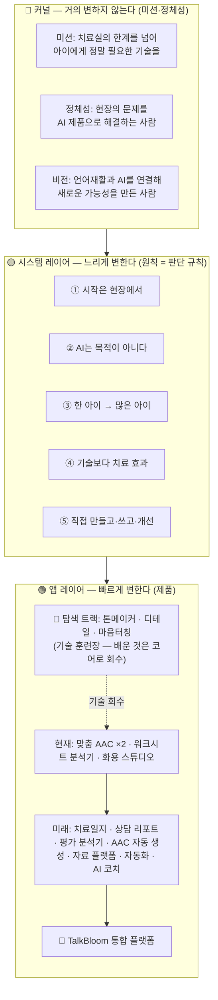
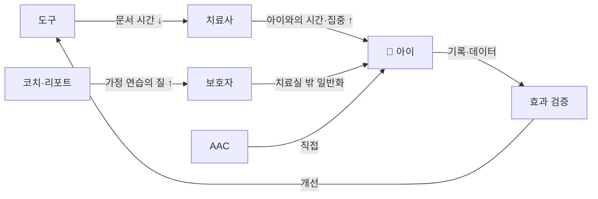
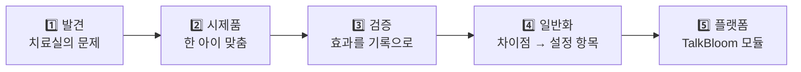

# 재조합 1 — 세계관 지도

Brand "OS"라는 이름을 진지하게 받아들이면, 세계관은 운영체제처럼 3층으로 조립된다. **아래층일수록 바꾸기 어렵고, 위층일수록 자주 바뀌어야 정상이다.**

## 가치 전달 사슬 (긴장 3의 해소)

제품 대부분이 치료사용인 이유를 사슬로 명시하면 모순이 사라진다:

**모든 화살표는 결국 아이에서 끝나고, 검증 루프를 타고 도구로 돌아온다.** 이 순환이 [[원칙 5 — 직접 만들고 직접 쓰고 직접 개선한다]]의 확장판이다.

## N=1 → N=다수 파이프라인 (긴장 1의 해소)

현재 위치: 맞춤 AAC는 2단계 (H·J 두 사례), 워크시트 분석기는 3단계 진입 중, 화용 스튜디오는 4단계(프로젝트 복제·아동별 기록까지 감).

## 연결

- 이 지도를 문장으로 쓴 것 → [[재조합 2 — Brand OS v0.2 제안]]
- 지도의 근거 → [[메타 1 — 논리 레벨 분석]], [[메타 3 — 긴장과 모순]]
